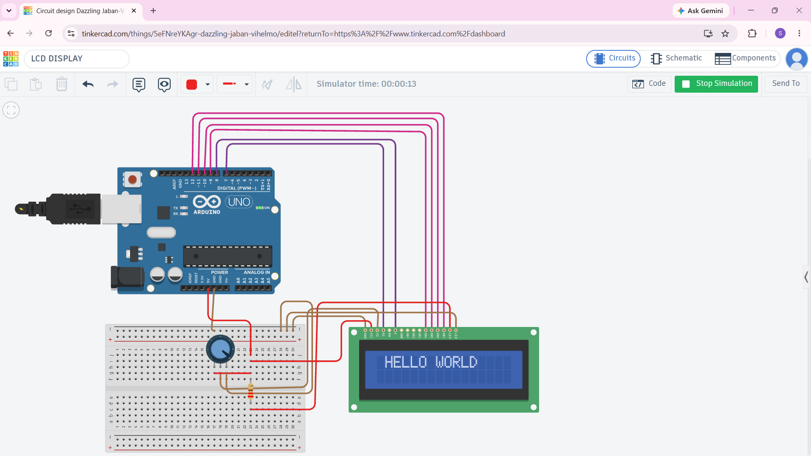

# Arduino 16x2 LCD

## About

This is my Arduino 16x2 LCD project.

I learned how to connect a 16x2 LCD to an Arduino UNO and display text on the LCD.

## Components Used

- Arduino UNO
- 16x2 LCD
- 10kΩ Potentiometer
- 220Ω Resistor
- Breadboard
- Jumper Wires

## LCD Connections

| LCD Pin | Function | Arduino |
|---|---|---|
| 1 | VSS | GND |
| 2 | VDD | 5V |
| 3 | V0 | Potentiometer |
| 4 | RS | D7 |
| 5 | RW | GND |
| 6 | E | D8 |
| 11 | D4 | D9 |
| 12 | D5 | D10 |
| 13 | D6 | D11 |
| 14 | D7 | D12 |
| 15 | A | 5V through 220Ω |
| 16 | K | GND |

## Code

The Arduino program uses the `LiquidCrystal` library to control the LCD.

## Output

The LCD displays:

**DREAM**

## Circuit

## What I Learned

- How a 16x2 LCD works
- LCD pin connections
- How to use a potentiometer for contrast
- `LiquidCrystal` library
- `lcd.begin()`
- `lcd.setCursor()`
- `lcd.print()`
