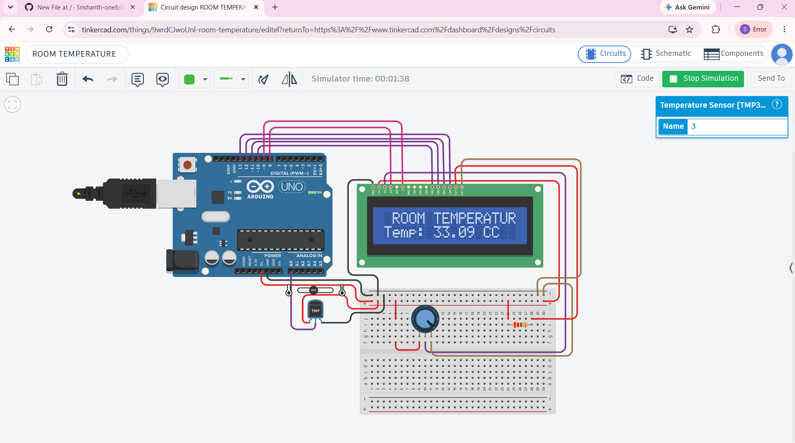

# LCD Room Temperature Display

## About

This project measures room temperature using a TMP36 temperature sensor and displays the temperature on a 16x2 LCD using an Arduino UNO.

## Components Used

- Arduino UNO
- TMP36 Temperature Sensor
- 16x2 LCD
- 10kΩ Potentiometer
- 220Ω Resistor
- Breadboard
- Jumper Wires

## Working

The TMP36 sensor produces a voltage according to the temperature.

The Arduino reads this voltage through the analog pin A0.

The Arduino then:

1. Reads the TMP36 sensor value.
2. Converts the analog reading into voltage.
3. Converts the voltage into temperature in °C.
4. Displays the temperature on the 16x2 LCD.
5. Sends the temperature value to the Serial Monitor.

## Arduino Connections

| Component | Arduino UNO |
|---|---|
| TMP36 Output | A0 |
| TMP36 GND | GND |
| TMP36 VCC | 5V |
| LCD RS | D8 |
| LCD E | D9 |
| LCD D4 | D10 |
| LCD D5 | D11 |
| LCD D6 | D12 |
| LCD D7 | D13 |
| LCD RW | GND |
| LCD VSS | GND |
| LCD VDD | 5V |
| LCD V0 | Potentiometer |

## Output

The LCD displays:

ROOM TEMPERATURE:

Temp: 25 C

The actual temperature changes according to the TMP36 sensor reading.

## Circuit

![LCD Room Temperature Circuit](# LCD Room Temperature Display

## About

This project measures room temperature using a TMP36 temperature sensor and displays the temperature on a 16x2 LCD using an Arduino UNO.

## Components Used

- Arduino UNO
- TMP36 Temperature Sensor
- 16x2 LCD
- 10kΩ Potentiometer
- 220Ω Resistor
- Breadboard
- Jumper Wires

## Working

The TMP36 sensor produces a voltage according to the temperature.

The Arduino reads this voltage through the analog pin A0.

The Arduino then:

1. Reads the TMP36 sensor value.
2. Converts the analog reading into voltage.
3. Converts the voltage into temperature in °C.
4. Displays the temperature on the 16x2 LCD.
5. Sends the temperature value to the Serial Monitor.

## Arduino Connections

| Component | Arduino UNO |
|---|---|
| TMP36 Output | A0 |
| TMP36 GND | GND |
| TMP36 VCC | 5V |
| LCD RS | D8 |
| LCD E | D9 |
| LCD D4 | D10 |
| LCD D5 | D11 |
| LCD D6 | D12 |
| LCD D7 | D13 |
| LCD RW | GND |
| LCD VSS | GND |
| LCD VDD | 5V |
| LCD V0 | Potentiometer |

## Output

The LCD displays:

ROOM TEMPERATURE:

Temp: 25 C

The actual temperature changes according to the TMP36 sensor reading.

## Circuit

## What I Learned

- How to use a TMP36 temperature sensor
- How to read an analog sensor using `analogRead()`
- How to convert an ADC reading into voltage
- How to convert voltage into temperature
- How to use a 16x2 LCD
- How to use `lcd.setCursor()`
- How to use `lcd.print()`
- How to use `Serial.begin()`
- How to use `Serial.println()`

## What I Learned

- How to use a TMP36 temperature sensor
- How to read an analog sensor using `analogRead()`
- How to convert an ADC reading into voltage
- How to convert voltage into temperature
- How to use a 16x2 LCD
- How to use `lcd.setCursor()`
- How to use `lcd.print()`
- How to use `Serial.begin()`
- How to use `Serial.println()`
